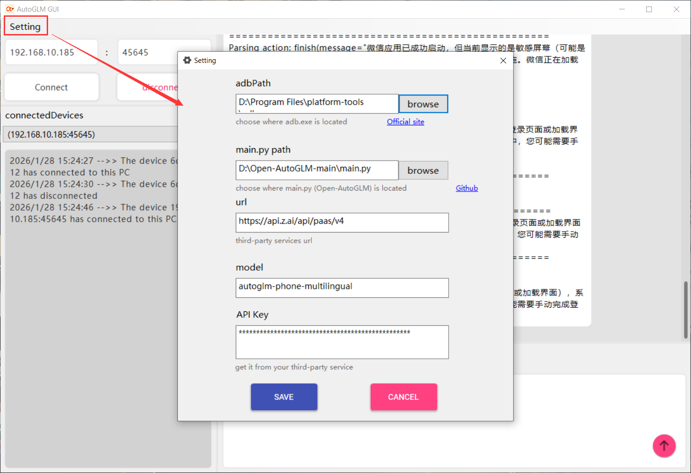
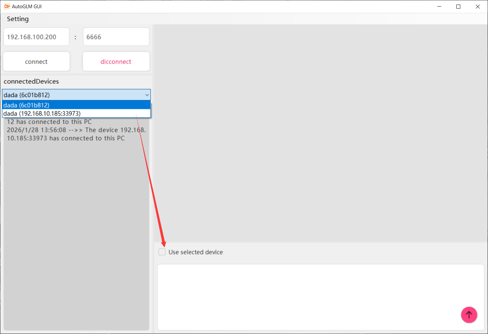
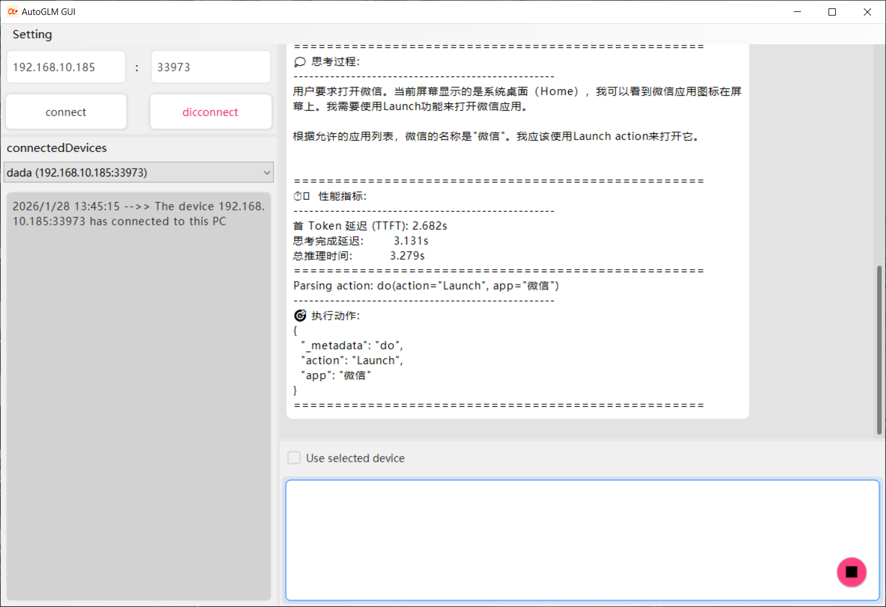

# Open-AutoGLM_GUI

[阅读中文](README.md)

## Project Introduce

Open-AutoGLM_GUI is a GUI based on [Open-AutoGLM ](https://github.com/zai-org/Open-AutoGLM).  The instruction below is basically abstracted from Official GitHub repository that is necessary for this project. Visit [Open-AutoGLM ](https://github.com/zai-org/Open-AutoGLM) to get more information about Open-AutoGLM.

## Environment Setup

### 1. Python Environment

Python 3.10 or higher is recommended.

### 2. Device Debug Tools

Choose the appropriate tool based on your device type:

#### For Android Devices - Using ADB

1. Download the official ADB [installation package](https://developer.android.com/tools/releases/platform-tools) and extract it to a custom path
2. Configure environment variables

#### For HarmonyOS Devices

Waiting for adaption

### 3. Android 7.0+ or HarmonyOS Device with `Developer Mode` and `USB Debugging` Enabled

1. Enable Developer Mode: The typical method is to find `Settings > About Phone > Build Number` and tap it rapidly about 10 times until a popup shows "Developer mode has been enabled." This may vary slightly between phones; search online for tutorials if you can't find it.
2. Enable USB Debugging: After enabling Developer Mode, go to `Settings > Developer Options > USB Debugging` and enable it
3. Some devices may require a restart after setting developer options for them to take effect. You can test by connecting your phone to your computer via USB cable and running `adb devices` to see if device information appears. If not, the connection has failed.

**Please carefully check the relevant permissions**


### 4. Install ADB Keyboard (Required for Android Devices Only, for Text Input)

If you are using an Android device:

Download the [installation package](https://github.com/senzhk/ADBKeyBoard/blob/master/ADBKeyboard.apk) and install it on the corresponding Android device.
Note: After installation, you need to enable `ADB Keyboard` in `Settings > Input Method` or `Settings > Keyboard List` for it to work.(or use command `adb shell ime enable com.android.adbkeyboard/.AdbIME`[How-to-use](https://github.com/senzhk/ADBKeyBoard/blob/master/README.md#how-to-use))

## Deployment Preparation

### 1. Install Dependencies

Download [Open-AutoGLM ](https://github.com/zai-org/Open-AutoGLM), extract to a custom path.

```bash
pip install -r requirements.txt 
pip install -e .
```

### 2. Configure ADB or HDC

***Note: You can check whether adb.exe is working following the below steps, or you can just check in Auto-GLM GUI.exe*** 

Before running on cmd, you should add the directory where adb.exe located into the **`System variables > Path`**. How to open Environment Variables: `Settings >  System > About > Advanced system settings > Environment Variables`

#### For Android Devices

1. Via USB cable

   Make sure your **USB cable supports data transfer**, not just charging.

   Ensure ADB is installed and connect the device via **USB cable**:

   ```bash
   # Check connected devices
   adb devices
   
   # Output should show your device, e.g.:
   # List of devices attached
   # emulator-5554   device
   ```

2. Via WiFi/network

   You can also connect your devices via WiFi/network

   Ensure the phone and computer are on the same WiFi network, go to `Settings > Developer Options > Wireless Debugging` as shown:

   

   Use Standard ADB Commands on Computer

   ```bash
   # Android device - Connect via WiFi, replace with the IP address and port shown on your phone
   adb connect 192.168.1.100:5555
   
   # Verify connection
   adb devices
   # Should show: 192.168.1.100:5555    device
   ```


### 3. Start Model Service

You can choose to deploy the model service yourself or use a third-party model service provider.

#### Option A: Use Third-Party Model Services

If you don't want to deploy the model yourself, you can use the following third-party services that have already deployed our model:

**1. z.ai**

- Documentation: https://docs.z.ai/api-reference/introduction

- Parameters use in OpenAutoGLM_GUI.exe:

  url: ` https://api.z.ai/api/paas/v4`

  model: `autoglm-phone-multilingual`

  API Key: Apply for your own API key on the z.ai platform

**2. Novita AI**

- Documentation: https://novita.ai/models/model-detail/zai-org-autoglm-phone-9b-multilingual

  url: `https://api.novita.ai/openai`

  model: `zai-org/autoglm-phone-9b-multilingual`

  API Key: Apply for your own API key on the Novita AI platform

#### Option B: Deploy Model Yourself

For detailed step, visit [Open-AutoGLM--Step: deploy-model-yourself](https://github.com/zai-org/Open-AutoGLM/blob/main/README_en.md#option-b-deploy-model-yourself)

If you have deployed successfully, just change the url to your own, should be like `http://localhost:8000/v1`, change the model to your served model name

## How to build exe from GitHub Actions

if you don't have any development environment, you can use GitHub to build exe

1. Sign in GitHub

2. Create Repository

3. Upload source code

   - Click "+" on the upper right corner > "New repository"
   - Repository name: `OpenAutoGLM_GUI`
   - Choose visibility: Private or Public
   - Click "Create repository"

4. Upload Open-AutoGLM_GUI to your repository

   First Download Open-AutoGLM_GUI to your PC

   Option A: Use Git Command Line

   ```
   # 1. switch directory
   cd Open-AutoGLM_GUI
   
   # 2. Start a new repo
   git init
   
   # 3. Add all untracked files and unstaged changes
   git add .
   
   # 4. Make a commit
   git commit -m "Initial commit"
   
   # 5. Add a Remote（replace your github username)
   git remote add origin https://github.com/YOUR_USERNAME/Open-AutoGLM_GUI.git
   
   # 6. Push the main branch to the remote
   git branch -M main
   git push -u origin main
   ```

   Option B: Upload on GitHub Website

   1. Click "uploading an existing file" on your repository you just created
   2. Drag  files to the webpage
   3. Click "Commit changes"

5. Waiting for GitHub Build

   Click "Actions" on repository, you should see a work flow named "build exe" is running, wait until it done

6. Download EXE

   When the workflow is done, click "build", you will see "**Artifacts**" on the bottom of right, click download button and it'll download "OpenAutoGLM_GUI.zip" automatically, unzip to get "OpenAutoGLM_GUI.exe"

## Tutorial

Setup the Parameters correctly in Setting



Input IP&Port on the left, make sure IP is reachable, click connect. It can automatically detect devices when using USB cable (make sure you have allowed USB debugging)

When Multiple devices are connected, check **`Use selected device`** to designate the device you select on **`connectedDevices`**, single device no need to check



Input the command on the bottom of right, press `enter` to execute, you can break at anytime when generating



## Acknowledgements

- [Open-AutoGLM](https://github.com/zai-org/Open-AutoGLM) : Core repository
- [SharpADBClient](https://github.com/quamotion/madb) : Communicate with Android devices.
- [AntdUI](https://github.com/AntdUI/AntdUI) & [Materialskin2](https://github.com/leocb/MaterialSkin) : UI

